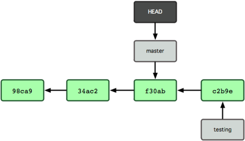

class: center, middle, inverse

# Advanced Git
### Ivan Kruglov

.footnote[
  created with [remark](http://github.com/gnab/remark)
]

---
class: center, middle, inverse
## What do you expect?

---
## git internals

- git - Directed Acyclic Graphs (DAG)

- each object has ID (SHA1)

---

layout: true
.footnote[.small[http://git-scm.com/book/en/]]

---
## git branching
# 

.center[]

```terminal
    git cat-file c3ab08e -p
```

---
## git branching
# 

.center[]

---
## git branching
# 

.center[]

---
## git branching
# 

.center[]

```terminal
    $ git branch testing
```

---
## git branching
# 

.center[]

---
## git branching
# 

.center[]

```terminal
    $ git checkout testing
```

---
## git branching
# 

.center[]

```terminal
    $ git commit LICENSE -m "add LICENSE"
```

---
## git branching
# 

.center[]

```terminal
    $ git checkout master
```

---
## git branching
# 

.center[]

```terminal
    $ git commit README -m "update README"
```

---
## git branch

 - git branch -m

 - git branch -d (-D)

 - git push --delete origin branch

---
## git commit

- git commit --amend

---
## git rebase

- principles of rebasing

- git rebase -i

- edit commit

- squah commit

- remove commit

- split commit

- add new commit

---
## git cherry-pick

---
## git revert

- git revert is a negative cherry-pick

- git revet -m

---
## git stash

- stash vs branch

- git stash branch

---
## git add/reset

- git add -p
- git reset -p

---
## git log

- git log -p
- git log --author
- git log --grep
- git log --pretty

---
## git bisect

- git bisect run


---
## Links

- http://git-scm.com/book
- http://pcottle.github.io/learnGitBranching/
- http://eagain.net/articles/git-for-computer-scientists/


---
vim: ft=markdown
