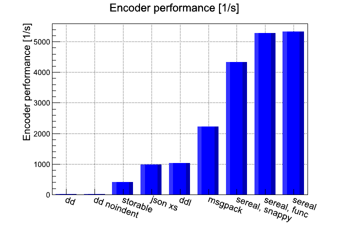
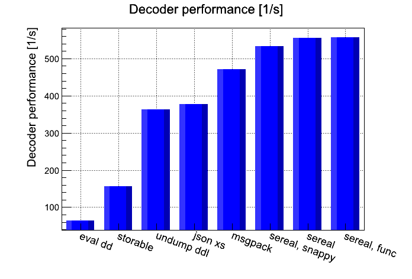
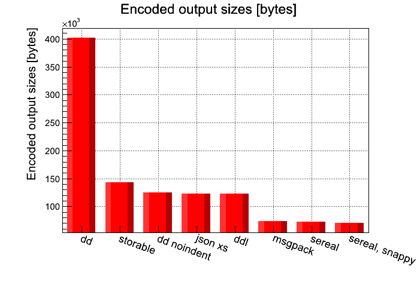

class: center, middle, inverse

# Sereal and its tooling
## YAPC::EU 2015
### Ivan Kruglov
#### Booking.com

.footnote[
  created with [remark](http://github.com/gnab/remark)
]

---
## What is Sereal?

- Fast, compact, schema-less, binary serialization protocol

- Created by group of engineers at Booking.com

- Supports all sane Perl data types, objects, etc

- Written for Perl in XS

- Implementations in other languages
    - Go
    - Erlang
    - Python
    - Ruby
    - Objective-C

---
## Why Sereal was created, its design 

```


```

.center[
LPW2014 Yves Orton (demerphq)

An introduction to Sereal, a better Storable

https://www.youtube.com/watch?v=DaFmisqdBd8
]

--
```


```

.red[.center[ spoiler: Storable is horrible, use Sereal!!! :-) ]]

---
class: center, middle



.small[ [benchmarking and more graphs](https://github.com/Sereal/Sereal/wiki/Sereal-Comparison-Graphs)]

---
class: center, middle



.small[ [benchmarking and more graphs](https://github.com/Sereal/Sereal/wiki/Sereal-Comparison-Graphs)]

---
class: center, middle



.small[ [benchmarking and more graphs](https://github.com/Sereal/Sereal/wiki/Sereal-Comparison-Graphs)]

---
## Event stream

- Producers generate messages

- Consumers process messages

- Transport and storage

```


                     /---------/     +---------+
        producer ----| message |---->| storage |----> consumer
                     /---------/     +---------+
```

---
## Producers

- messages are schemaless

- devs put anything they want

- shit happens: cyclic references, regexp, etc

- messages contain useful information

- discarding a message is not an option

- cleaning stuff is expensive

---
## Producers. Cool features.

- supports all **sane** Perl data structures

- support for cyclic data structures and aliases

- compression (snappy, zlib)

---
## Event stream

- Producers generate messages

- **-> Consumers process messages**

- Transport and storage

---
## Consumers

- data is for read-only access

--

- aliasing integers
    - -30% in decoding time
    - -50% in memory consumption

--

- more to come

---
## Event stream

- Producers generate messages

- Consumers process messages

- **-> Transport and storage**

---
## Transport and storage

- UDP

- short-term (hours) and medium-term (days) storages

- messages are grouped into "streams"

---
## Transport and storage. Cool features.

- deduplication of keys (for free) and strings (at some cost)

- array of encoded messages => encoded array of messages

    - [ srl($a), srl($b) ] => srl([ $a, $b ])

    - reduces space by ~30% without compression

--

- problem: need to decode and encode

---
## Transport and storage (continued)

- Sereal::Merger

    - srl($a), srl($b), srl($c) => srl([$a, $b, $c])

    - works with encoded data

    - avoid decoding/encoding cycle

    - can also dedupe strings

    - 30-50% of speedup vs decoding/encoding

--

- Headers

    - feature of Sereal, tiny embedded Sereal documents

    - store routing information

    - { epoch => 1441173612, type => 'WEB', persona=>'app' }

---
## Transport and storage (continued)

- store data in Riak

- data needs to be split

- slicing by substr

    - fine in general

    - but we wanted data to be ready for MapReduce

--

- Sereal::Splitter (by Damien Krotkine a.k.a dams)

    - srl([$a, $b, $c]) => srl($a), srl($b), srl($c)

    - works with encoded data

    - avoid decoding/encoding cycle

---
## Sereal::Path

- query engine for Sereal

    - similar to what XPath for XML and JSONPath for JSON

    - [ { key => $a }, { key => $b } ]

    - '$[*][key]' => [ $a, $b ]

- implements limited subset of JSONPath's syntax

- works with binary data

- many X speedup depending on size

---
## Status of modules

- Sereal

    - Sereal::Encoder - production ready

    - Sereal::Decoder - production ready

- Sereal::Merger - stable

- Sereal::Splitter - production ready

- Sereal::Path - ongoing project

---
class: center, middle, inverse

# Thank you!
### https://github.com/Sereal/Sereal

---
vim: ft=markdown
